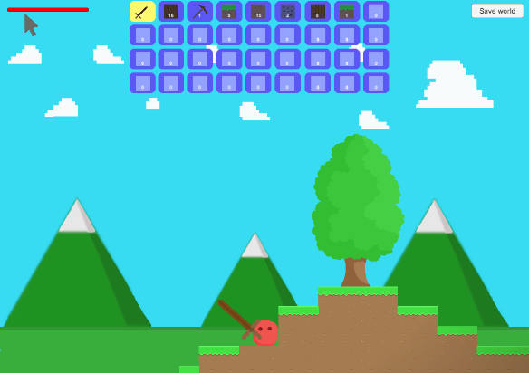
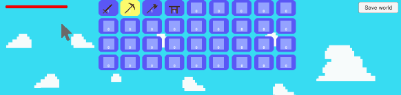

# CreativeCraft
It is my first game created in Unity. It is based on the game Terraria. 
You can procedurally generate world with caves and ores, which you can explore.

## Main features
* Procedurally generated world
* Caves generated by Cellular Automata Method
* Ores generated by my own method
* Equipment
* Tools like: a pickaxe, an axe, a sword
* Furnishings like: workbench, furnace
* Ability to destroy or create any tile you want
* Trees and the ability to chop them
* Enemies
* Fall damage
* Player has a certain range where he can destroy or create tiles
* World saving system
* Sounds: sound when you destroy a tile, sound when you fall from height, enemies sounds, background music
* Dynamic lighting and shading
* Backgrounds

## Screenshots
* Created a world map

* Generated ores

* JSON File, which contains saved world

* Generated trees

* Destroy some tiles

* Build a simple house

* Chopped tree is falling down

* When a tree fell, it dropped some wood tiles

* Player cursor when he has range

* Player cursor when he has no range

* Player's starting EQ

* Move the item stack from one eq slot to another

* Move a single item from one eq slot to another

* Connect two item stacks together

* Collect item from ground

* Changing actual selected eq slot, by typing 0-9 key on keyboard

* Craft pickaxe in workbench

* Get a copper ingot from the furnace

* Selecting tools for eq changes the player appearance

* All enemies

* Dynamic lighting and shading

* Backgrounds

